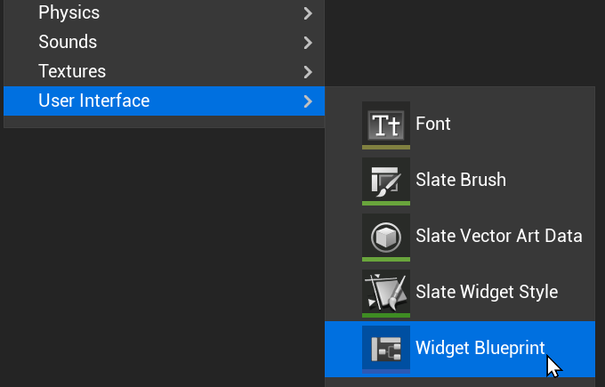
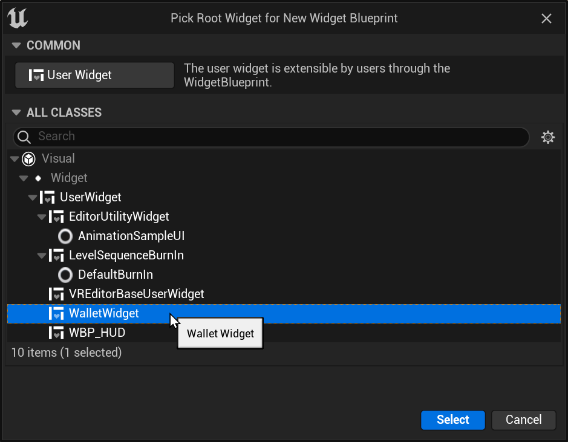
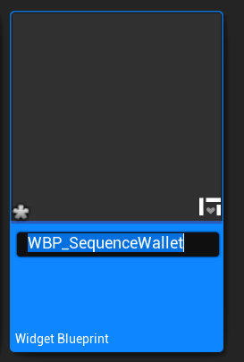
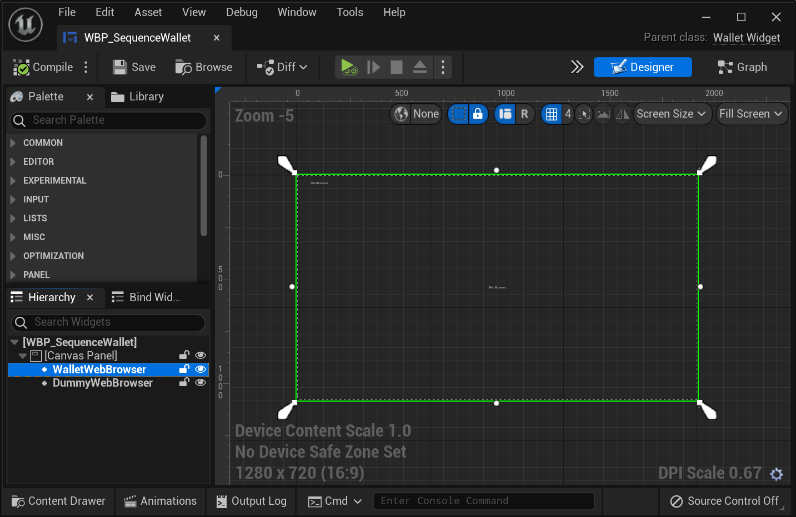
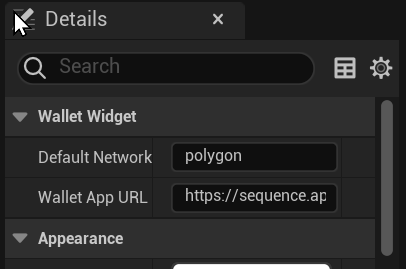
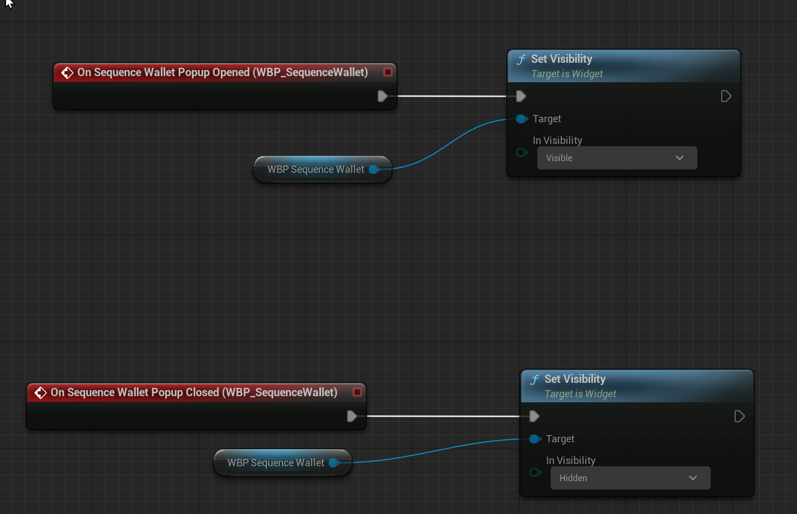
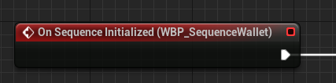
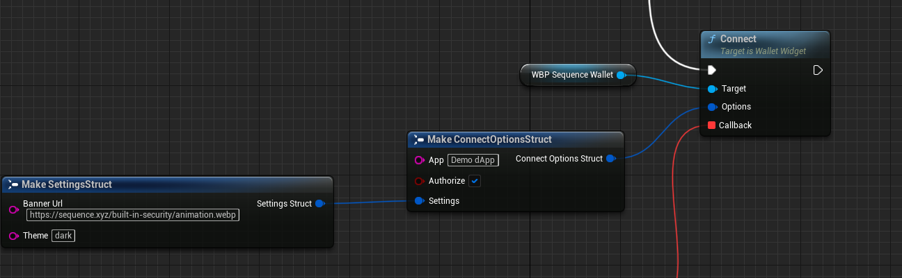
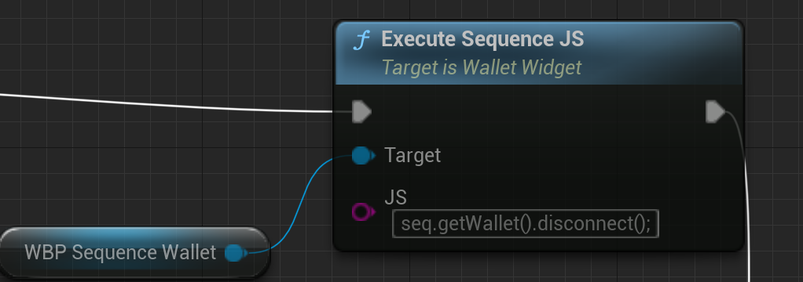
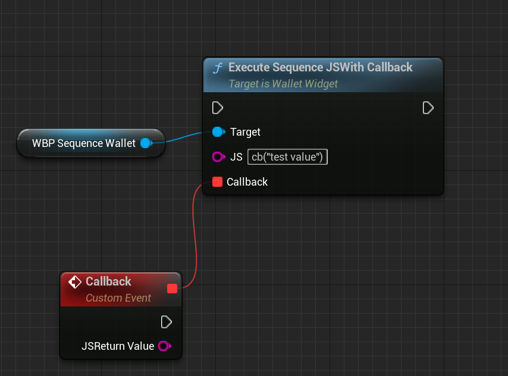

# UnrealSequence

Sequence Wallet plugin for Unreal Engine!
This plugin is currently in **Alpha**.
It works enough to develop against, but not enough to be released.
Connecting wallets, sending transactions, etc, work!
The following features still need work.
- "Connect" popups show the url "example.com".
- Login methods other than Google and Email haven't been tested, and may not work.
- There's no way to force a user to be logged out of their Sequence wallet.
- non-sequence.app URLs clicked from the wallet take over the wallet UI.

# Usage Instructions

## Install

### Install to a project
1. Navigate to your Project folder - the folder with the `[ProjectNameHere].uproject` file in it.
2. Create a folder called `Plugins`, if it doesn't already exist.
3. Copy the entire `web3-unreal-sdk` folder into the `Plugins` folder.

### Install globally to Unreal Engine
1. Navigate to your Unreal Engine installation folder - on Windows, the default is `C:\Program Files\Epic Games\UE_5.0\Engine`
2. Copy the entire `web3-unreal-sdk` folder into the `Plugins` folder.

Finally, in the Unreal Editor, go to `Menu -> Edit -> Plugins`, and enable the `UnrealSequence` plugin.

## Setting up UnrealSequence
This setup assumes you're using UMG & Blueprints.

1. Create a Widget Blueprint. 
2. Select "WalletWidget" as the parent class. 
3. Give your blueprint a name, like `WBP_SequenceWallet`. 
4. Add the two required WebBrowser widgets to the blueprint. One must be named `DummyWebBrowser`, the other must be named `WalletWebBrowser`. The easiest way is to put them in a `CanvasPanel`. The `WalletWebBrowser` is the one that will render the Sequence Wallet, so you should probably make it full-size in your `CanvasPanel`. The `DummyWebBrowser` should probably be 0-sized & collapsed. 
5. If you'd like, you can now customize the default network and wallet app URL by changing the Wallet Widget settings under Details.

## Hiding and showing the wallet
The Wallet blueprint you created will have events for when the wallet is requesting to be shown and hidden. You should hook those up in your UI to hide & show the blueprint.

## Initialization
The wallet will be automatically initialized using the default network you configured in the widget settings.
You must wait for the OnSequenceInitialized event before using any Sequence functions.

## Connecting the Wallet
There is a `GetIsConnected` function you can call to see if the wallet is connected.
If it isn't, you can call the `Connect` function, and call `GetIsConnected` again afterwards to see if the user approved the connection.

## Executing Sequence.js code, and getting callbacks

For Sequence.JS docs, see https://docs.sequence.xyz/

You can execute arbitrary Sequence.JS code with the function `Execute Sequence JS`. 
The Sequence SDK is available at the global object named `seq`. You can access the Wallet object with `seq.getWallet()`.

If you need to return data from a call, you can use the `Execute Sequence JS with Callback` function. In your JS code, call the function `cb` to return any arbitrary string to the Callback event you pass. 
If you don't call the `cb` function, you will leak memory.

### Important Note - Valid JS
ExecuteJS will collapse all your JS to one line. Make sure every statement is semicolon-terminated, and you don't have any `//` comments, only `/* */` comments.

## Console.log, warning, and errors
Logs from the browser contexts will show up in your Unreal log under the LogSequence category.

## Debugging
Unreal Engine has an undocumented parameter, `-cefdebug=<port_number>`, that you can pass on the command line to use the Chrome devtools with.
Thanks to `iktomi` on the Unreal Engien forums for this lifesaving tip.